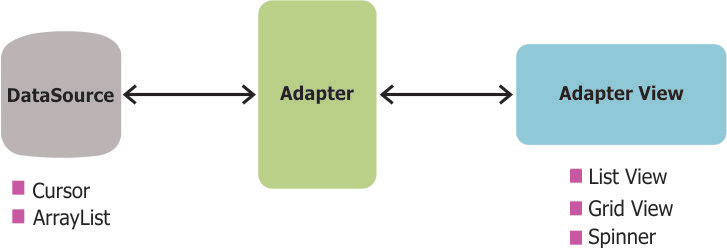
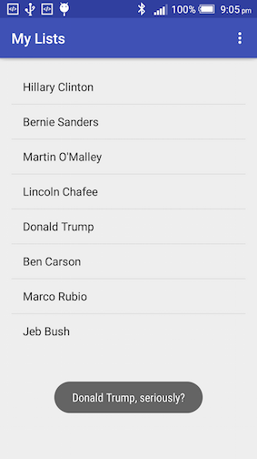
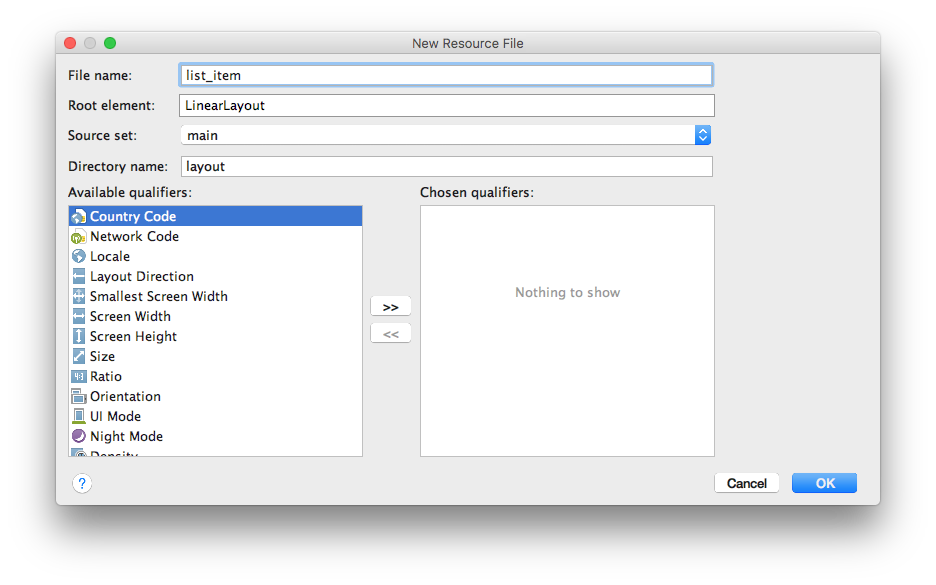
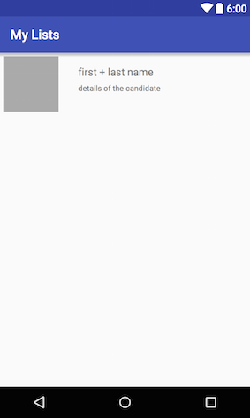
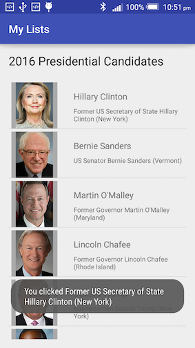
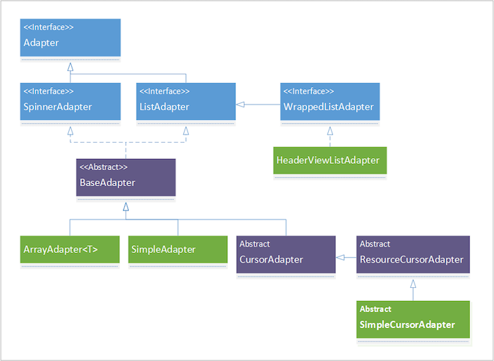
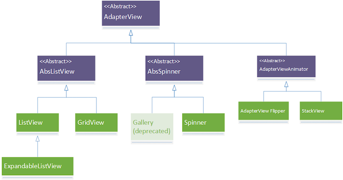

# Develop Kotlin App with AdapterViews

What do you do if the app needs to handle data of a large quantity or dynamically generated? Do you put say 200 student records in TextViews one after another? Obviously, the answer is no here. Let's find out how to do it properly.

## Lab 1 AdapterViews

Spinners you looked at previously is a special case i.e. subclass of AdapterView. In order to get it work, yous had to combine three elements: the View itself (Spinner), the data resource which is typically a Collection (interface), an Adaptor that binds every *single entry* in the Collection with its layout. 

<!--  -->


Now let's look at some more subclasses of AdapterView.

### Simple ListView

Using default options, create a new project and name it 'MyList'. Then, follow steps below to create a simple list:

1. First of all, define some data to play with. Insert the following into string.xml. 
    
    ```xml
    <string-array name="candidateNames">
        <item>Hillary Clinton</item>
        <item>Bernie Sanders</item>
        <item>Martin O\'Malley</item>
        <item>Lincoln Chafee</item>
        <item>Donald Trump</item>
        <item>Ben Carson</item>
        <item>Marco Rubio</item>
        <item>Jeb Bush</item>
    </string-array>

    <string-array name="candidateDetails">
        <item>Former US Secretary of State Hillary Clinton (New York)</item>
        <item>US Senator Bernie Sanders (Vermont)</item>
        <item>Former Governor Martin O\'Malley (Maryland)</item>
        <item>Former Governor Lincoln Chafee (Rhode Island)</item>
        <item>Businessman Donald Trump (New York)</item>
        <item>Dr. Ben Carson (Florida)</item>
        <item>US Senator Marco Rubio (Florida)</item>
        <item>Former Governor Jeb Bush (Florida)</item>
    </string-array>
    ```
2. Open activity_main.xml, delete the default TextView and drag/drop a ListView from Containers sub-group in Palette. In text mode, rearrange XML so it looks like this
    
    ```xml
    <ListView
        android:layout_width="match_parent"
        android:layout_height="match_parent"
        android:layout_marginBottom="8dp"
        android:layout_marginLeft="8dp"
        android:layout_marginRight="8dp"
        android:layout_marginTop="8dp"
        android:id="@+id/myList"
        app:layout_constraintBottom_toBottomOf="parent"
        app:layout_constraintLeft_toLeftOf="parent"
        app:layout_constraintRight_toRightOf="parent"
        app:layout_constraintTop_toTopOf="parent" />
    ```
    
3. Open MainActivity.kt, insert the following after setContentView of OnCreate() function:
    
    ```kotlin
    val candideNames = resources.getStringArray(R.array.candidateNames)
    val listView : ListView = this.findViewById(R.id.myList)
    ```
    
4. In MainActivity.kt, insert the following into the `onCreate()` method after the code inserted in step 3:
    
    ```kotlin
    candidateNames = getResources().getStringArray(R.array.candidateNames);
    
    val arrayAdapter = ArrayAdapter<String>(this, android.R.layout.simple_list_item_1, candideNames)
    listView.adapter = arrayAdapter
    //using lambda syntax
    listView.setOnItemClickListener { parent, view, position, id ->
        Toast.makeText(this, "${candideNames[position]}, seriously?", Toast.LENGTH_LONG).show()
    }
    ```
    
    What the code above does is to associate the ListView declared in the layout file with the data (string array) declared in string resource. ArrayAdapter takes three parameters: context, a layout resource for a single element of data, and the data. Here `android.R.layout.simple_list_item_1` is a system-defined resource layout file that contains only one TextView. You can define you own resource files as you see later on.
    
    > [simple_list_item_1](https://github.com/android/platform_frameworks_base/blob/master/core/res/res/layout/simple_list_item_1.xml) on Github.
    
    Inside `setOnItemClickListener()` block is an anonymous inner class. There're two ways of defining an onClickListener, one is to do `public void doSomething(View v)` and then associate with View's `onClick` attribute in XML, the other is what you see here. Note here instead of declaring `View.onClick()` for Buttons, it declared `AdapterView.OnItemClickListener()` wich is specific for AdapterViews. Here 'parent' is the parent view of single data entry, in our case is the ListView,  view is the View being clicked, position is the 'index' of current view within the adapter, id is the row id the data entry.
    
    The question mark inside angle brackets is Java generic wildcard, which basically means the type of parent passed into the method is an AdapterView of any type.
    
If you run the app, what you'll see is something like this:



Modify the code acoording to the table :

```kotlin
var candidateNames = resources.getStringArray(R.array.candidateNames)
val listView : ListView = this.findViewById(R.id.myList)
//val arrayAdapter = ArrayAdapter<String>(this, android.R.layout.simple_list_item_1, candidateNames)

var candidateList : MutableList<String> = candidateNames.toMutableList()
val listAdapter = ArrayAdapter<String>(this, android.R.layout.simple_list_item_1, candidateList)
listView.adapter = listAdapter
//using lambda syntax
listView.setOnItemClickListener { parent, view, position, id ->
    Toast.makeText(this, "${candideNames[position]}, seriously?", Toast.LENGTH_LONG).show()
    candidateList.add("Stephen Au")
    listAdapter.notifyDataSetInvalidated()
}
```

Have a look at the code above, and try to answer the following questions:

* Why is it necessary to convert string array to array list?
* How does array adapter update the actual dataset i.e. candidate data?
* What is the purpose of `notifyDataSetInvalidated()`?

### Complex ListView

Simple ListView is useful for displaying data that can be converted to strings in easy steps. But if you want to have fine control of the presentation of single entries in your ListView, you need to provide customized layout files for your adapter. In this way, you'll make it a 'complex ListView'.

1. First of all, download some images to use later on. Click on [this link](https://github.coventry.ac.uk/300CEM-1718SEPJAN/TEACHING-MATERIALS/blob/master/Additional_resources/candidates_photos.zip) to go to GitHub page and then click 'View Raw' to download some images of US presidential election candidates. Add those to your res/drawable resources folder.
    
2. Create a new layout resource file by right-clicking on the layout folder and select New ==> Layout resource file. Name it list_item.xml. 
    
    
    
    Change the default orientation of the container LinearLayout from `vertical` to `horizontal`, and insert the following within the LinearLayout
    
    ```xml
    <?xml version="1.0" encoding="utf-8"?>
    <LinearLayout xmlns:android="http://schemas.android.com/apk/res/android"
        android:orientation="horizontal" android:layout_width="match_parent"
        android:layout_height="match_parent">
        <ImageView
            android:id="@+id/imageView"
            android:layout_width="85dp"
            android:layout_height="85dp"
            android:layout_marginLeft="5dp"
            android:layout_marginTop="5dp"
            android:background="@android:color/darker_gray"
            android:padding="8dp"
            android:scaleType="centerCrop" />
    
        <LinearLayout
            android:layout_width="match_parent"
            android:layout_height="wrap_content"
            android:layout_marginLeft="30dp"
            android:layout_marginTop="20dp"
            android:orientation="vertical">
    
            <TextView
                android:id="@+id/textViewName"
                android:layout_width="match_parent"
                android:layout_height="wrap_content"
                android:text="first + last name"
                android:textSize="16sp" />
    
            <TextView
                android:id="@+id/textViewDetail"
                android:layout_width="match_parent"
                android:layout_height="wrap_content"
                android:layout_marginTop="8dp"
                android:text="details of the candidate"
                android:textSize="12sp" />
    
        </LinearLayout>
    </LinearLayout>
    ```
    
    At the moment, your preview window should look like below. This is the layout for a single item in your list.
    
    
    
3. Create a new activity using the 'Empty Activity' template and name it PhotoListActivity. Open activity_photo_list.xml, insert the following into the container ConstraintLayout:
    
    ```xml
    <TextView
        android:id="@+id/textView"
        android:layout_width="wrap_content"
        android:layout_height="wrap_content"
        android:layout_alignParentLeft="true"
        android:layout_alignParentStart="true"
        android:layout_alignParentTop="true"
        android:layout_marginLeft="8dp"
        android:layout_marginStart="8dp"
        android:layout_marginTop="8dp"
        android:text="2016 Presidential Candidates"
        android:textAppearance="?android:attr/textAppearanceLarge"
        app:layout_constraintLeft_toLeftOf="parent"
        app:layout_constraintTop_toTopOf="parent"/>

    <ListView
        android:id="@+id/listViewComplex"
        android:layout_width="wrap_content"
        android:layout_height="wrap_content"
        android:layout_below="@+id/textView"
        android:layout_marginLeft="16dp"
        android:layout_marginRight="8dp"
        android:layout_marginStart="8dp"
        android:layout_marginTop="7dp"
        app:layout_constraintLeft_toLeftOf="parent"
        app:layout_constraintRight_toRightOf="parent"
        app:layout_constraintTop_toBottomOf="@+id/textView"/>
    ```
    
    This layout is very similar to the simple list example. The only difference is that it has an additional TextView above ListView.
   
4. Create a new data class called Candidate and insert the following in PhotoListActivity class
    
    ```kotlin
    data class Candidate(val name : String, val detail : String, val photo : Int)
    ```

5. In PhotoListActivity.kt, add the code in OnCreate() function after setContentView().
    
    ```kotlin
    var candidateNames = resources.getStringArray(R.array.candidateNames)
    var candidateDetails = resources.getStringArray(R.array.candidateNames)
    var candidatePhotos: Array<Int> = arrayOf(
        R.drawable.clinton,
        R.drawable.sanders,
        R.drawable.omalley,
        R.drawable.chafee,
        R.drawable.trump,
        R.drawable.carson,
        R.drawable.rubio,
        R.drawable.bush
    )
    var candidates = ArrayList<Candidate>()
    ```
    
    Note in the code above an array of integers is declared for drawable resources. (Why is the type int?)
    
6. Insert the following code after `candidates` array
    
    ```kotlin
    @Override
    for (i in 0 until candidateNames.size) {
        val c = Candidate(candidateNames[i], candidateDetails[i], candidatePhotos[i])
        candidates.add(c)
    }

    val listView: ListView = this.findViewById(R.id.listViewComplex)
    val listAdapter =
    CandidateAdapter(this, R.layout.list_item, candidates)
    listView.adapter = listAdapter
    //using lambda syntax
    listView.setOnItemClickListener { parent, view, position, id ->
        Toast.makeText(this, "You clicked ${candidates[position].name}", Toast.LENGTH_LONG).show()
    }
    ```
    
7. Create a new class called CandidateAdapter within the PhotoListActivity class. 
    
    ```kotlin
    //subclass of ArrayList<T>, you need to inherit the constructor as well.
    class CandidateAdapter(
        context: Context,
        resource: Int,
        objects: MutableList<Candidate>
    ) : ArrayAdapter<Candidate>(context, resource, objects) {
        private var resource = resource
        private var candidates = objects
        override fun getView(position: Int, convertView: View?, parent: ViewGroup): View {
            var v = convertView
            if (v == null){
                val layoutInflater = context.getSystemService(Context.LAYOUT_INFLATER_SERVICE) as LayoutInflater
                v = layoutInflater.inflate(resource, parent, false)
            }
            var imageView = v!!.findViewById<ImageView>(R.id.imageView)
            var textViewName = v!!.findViewById<TextView>(R.id.textViewName)
            var textViewDetail = v!!.findViewById<TextView>(R.id.textViewDetail)
            imageView.setImageResource(candidates[position].photo)
            textViewName.text = candidates[position].name
            textViewDetail.text = candidates[position].detail
            return v!!
        }
    }
    ```
    
    It's important to understand the code above: the CandidatesAdapter class extends ArrayAdapter of type Candidates. In the constructor, it needs the layout resource name i.e. the file that contains the customized layout XML created earlier. The most important method is `getView()`, where it checks if a convertView (i.e. old view) exists or not. If it doesn’t, it’ll need to inflate it. The reason for doing this is because ListView recycles its rows when they move out of the screen, instead of creating new ones, to save system resources. 
    
    > [How ListView's recycling mechanism works](http://stackoverflow.com/questions/11945563/how-listviews-recycling-mechanism-works)
    
    There're several different ways of getting an LayoutInflater object:
    
    * The code above, `LayoutInflater layoutInflater = (LayoutInflater) context.getSystemService(Context.LAYOUT_INFLATER_SERVICE)`, is from official [documentation](http://developer.android.com/reference/android/view/LayoutInflater.html).
    * You can use `LayoutInflater inflater = ((Activity)context).getLayoutInflater()`, see an example from [here](http://www.ezzylearning.com/tutorial/customizing-android-listview-items-with-custom-arrayadapter).
    * You can also use `LayoutInflater inflater = (LayoutInflater) CandidatesAdapter.this.getSystemService(Context.LAYOUT_INFLATER_SERVICE)`, see an example from [here](https://github.com/pranayairan/Code-Learn-Android-Example/blob/master/CodeLearnListExample/src/org/codelearn/codelearnlistexample/ListViewWithBaseAdapter.java).
    
    Note here `v.findViewById()` is different from `findViewById()`. `v.findViewById()` will only find sub views i.e. views being contained by 'v'; whereas `findViewById()` will find anything contained in the Activity.
    
    
9. Insert the following into activity_main.xml before the ListView
    
    ```xml
    <Button
        android:id="@+id/complexList"
        android:layout_width="wrap_content"
        android:layout_height="wrap_content"
        android:layout_marginLeft="8dp"
        android:layout_marginTop="8dp"
        android:onClick="onButtonClick"
        android:text="Complex List"
        app:layout_constraintLeft_toLeftOf="parent"
        app:layout_constraintTop_toTopOf="parent"/>
    ```
    
    You'll see that ListView and Button overlap at the top-left corner of the screen. Change the following attribute of `ListView` to have more space at the top `app:layout_constraintTop_toBottomOf="@+id/complexList"`
    
10. Open MainActivity.kt, insert the following into the class
    
    ```kotlin
    fun onButtonClick(v : View){
        val i = Intent(this, PhotoListActivity::class.java)
        startActivity(i)
    }
    ```
    
If you run the app, click on 'Complex List' button, you'll see the following:



<!-- ### Grid View was here-->

### AdapterView hierarchy

You saw ArrayAdapter already. If you Google online examples you'll see more Adapters such as BaseAdapter, ListAdapter, and SimpleAdapter etc. What are the relationships among these?

Basically, ArrayAdapter is the first concrete Adapter in the tree, above it are interfaces and an abstract class. But sometimes people do declare something like `ListAdapter listAdapter = new ArrayAdapter<String>()`, don't be confused.

<!--  -->


A similar hierarchy can be drawn for AdapterView and subclasses. Even though those 'collection' Views are named differently, they are in fact closely related to each other.

<!--  -->


> Above images are from a [blog](http://www.intertech.com/Blog/android-adapters-adapterviews/) written by Jim White.
